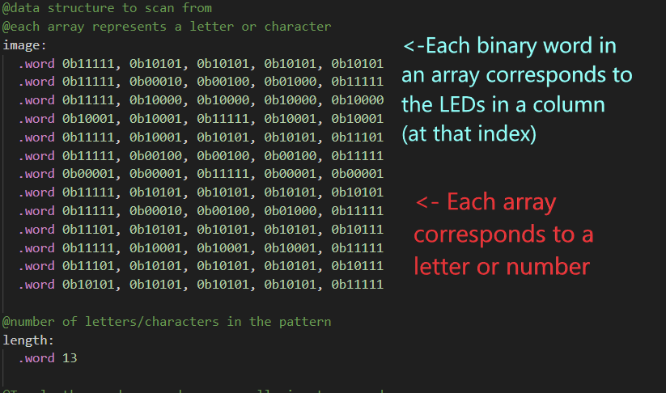
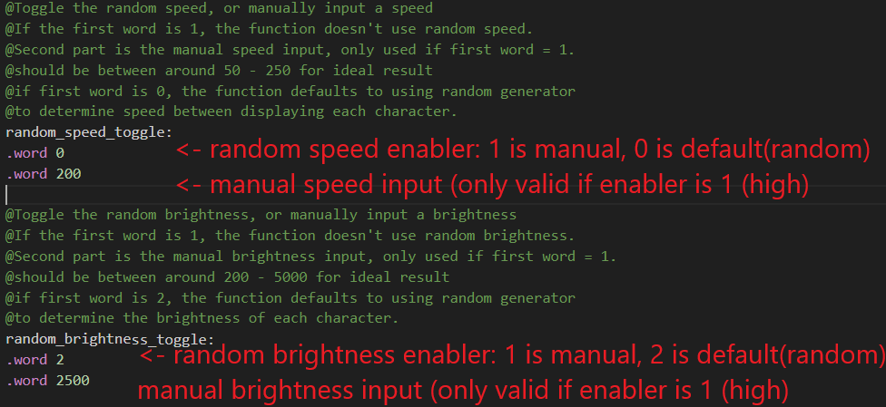

# Design Document

## COMP2300 Assignment 2 

 

### Preetish Thirumalai u7157098

 
 
 

## Design
The light show I chose to create for this assignment is a scanned display of letters spelling out ‘ENLIGHTEN 2023’. This was accomplished by declaring a data structure containing arrays of 5 binary ‘column’ numbers (see Appendix 1) and scanning this structure to display the images described in the arrays. Each array in the data structure corresponds to either a letter or number from ‘ENLIGHTEN 2023’. The number of characters in the display was declared in the ‘length’ data label, and this value was used as a loop condition to ensure the program repeated the pattern infinitely. The extensions I chose to implement for this assignment were random speed and random brightness. Speed refers to the time between displaying characters, and brightness refers to the screen level LED brightness of a particular character. The program allows the option to remove random speed and/or random brightness entirely, through the ‘random_speed_toggle’ and ‘random_brightness_toggle’ data labels. 

 

## Basic Implementation
The program utilises an inner loop (‘looper’) for displaying individual characters, and an outer loop (‘main’) to keep the display running infinitely. The inner loop of the program scans 5 binary words from an array in the ‘image’ data label, and calls the ‘write_row_pins’ function on each word, with a short delay between them to let current dissipate. The 'clearer' function is then called to clear the screen before the program moves to the next word in the array (the next column). After all 5 binary words have been displayed, the program loops, thereby displaying on screen the character denoted by the given array from the ‘image’ data label. After each iteration, a loop counter is incremented, and when the counter reaches a specified loop condition value, the program breaks to the ‘next_word’ function. The gap between letters being displayed (the speed) can be manipulated by changing the loop condition value, where the higher the loop value, the longer the transition time between displaying characters. The ‘next_word’ function then updates the scanning register with the memory address of the next array in the ‘image’ data label, and the program continues and displays the next character in ‘image’. A counter for the number of letters is also incremented by 1 in the ‘next_word’ function. Finally, when the ‘letter counter’ is equivalent to the value at the ‘length’ data label, the program has reached its conclusion and breaks to the ‘restart_loop’ function, which restarts the outer loop from the beginning and ensures the program runs infinitely. 

 

## Extensions Implementation

The implementation of random speed and random brightness were supported by the Microbit’s internal Random Number Generator. This generator was used as the basis for two functions, ‘random_delay’ and ‘random_modulation’, both found within the ‘helper_func.S’. Random_delay uses the random number generator, as well as the ‘modulo’ function described in ‘helper_func.S’ to return a random number between 70 and 266. The program branches to this function before declaring the loop condition value in the inner loop, and therefore can use this value to set a random loop condition for each character being scanned and displayed. As mentioned earlier, the loop condition value directly controls the speed between character displays, and therefore the speed between displaying each character is randomised. 

 

The ‘random_modulation’ function is similar to the ‘random_delay’  function, however it returns a number between 50 and 2450. This number is used to set the delay after a call to the  ‘write_row_pin’ function is made. As mentioned earlier, a slight delay was added after each call to ‘write_row_pin’ to let current dissipate. In the final implementation, this delay value is determined by branching to the ‘random_modulation’ function before branching to the ‘delay’ function. The longer the delay, the brighter the LEDs will be, since the lights are active for longer, and for shorter delays the LEDs will be dimmer. Through randomising the delay after each call to the ‘write_row_pin’ function, the program effectively randomises the LED brightness for each character in the display. 

 

## Flexibility Implementation
The ‘random_speed_toggle’ and ‘random_brightness_toggle’ data structures allow the program to use non-random manual inputs for both speed and brightness. The first inputs to these structures are the enablers (see Appendix 2), and the second inputs are the manual input values. The program pulls the enabler values from these two labels, and uses if-else cases to execute the program with either a manually input speed, manually input brightness, both or neither. If the toggles are ‘switched off’, the program defaults to using randomly generated speeds and/or brightnesses for each character display as defined previously. 

 

## Evaluation
The program allows for the implementation of a simple scanned display with specifiable characters, length, brightness and speed by adjusting the ‘image’, ‘length’, ‘random_speed_toggle’ and ‘random_brightness_toggle’ data labels respectively. This allows for straightforward modifiability by adjusting the program’s data structures. The extensions to speed and brightness are appropriate for this assignment, since variable screen level brightness and random number generators were both utilised in the final product. The general idea behind this assignment was to make a themed advertisement for the Enlighten festival. The randomly flashing characters with varying brightnesses were intended to catch the eye of people and get their attention.

 

## Limitations
The program is fairly inefficient, as there are several auxiliary functions being called on every iteration of the main loop, each requiring calls to the stack. Furthermore, the random number generator requires significant delays in order to function properly, adding to the overall time complexity of the program. A more efficient implementation could have used the inbuilt ‘Systick’ timer to determine the speed between displays, rather than using a loop counter value. An extension to this assignment would have been to integrate the Microbit's button interrupts into the program, possibly giving them the ability to control the brightness and speed of character displays. 

 

## Appendix

 

## Figure 1

 

## Figure 2

